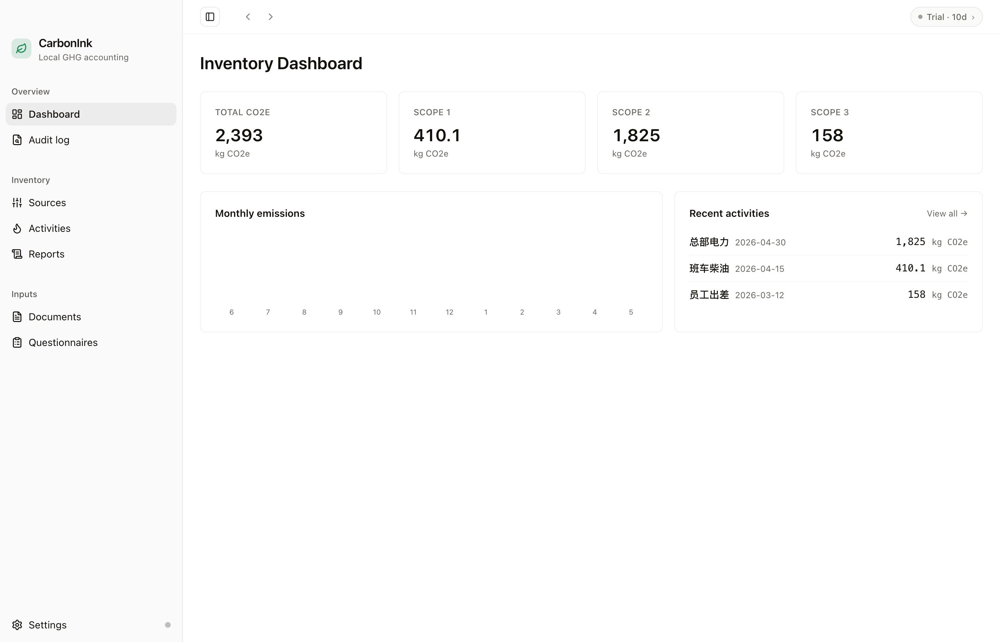

# CarbonInk · 碳墨

[](LICENSE)
[](https://github.com/lxzxl/carbonink/releases/latest)
[](https://github.com/lxzxl/carbonink/releases/latest)

**Free, open-source, local-first GHG accounting for the desktop.** Import your
bills, let the AI extract the activity data, and produce an ISO 14064-1 inventory
report — entirely on your own machine. No account, no cloud, no subscription.

> Licensed under the [MIT License](LICENSE). Runs fully offline; your data never
> leaves your device.



## Download

Grab the latest macOS / Windows build from the
[releases page](https://github.com/lxzxl/carbonink/releases/latest) — or visit
[carbonink.xyz](https://carbonink.xyz). No activation key required.

## What it does

- **Inventory** — emission sources, activity data, and pinned emission factors with
  audit-grade calculation snapshots (Scope 1 / 2 / 3).
- **AI extraction** — pull activity data from utility bills, fuel receipts, freight,
  travel, and purchase documents (bring your own LLM API key).
- **Questionnaires** — fill customer/rating-agency disclosure forms from your
  inventory (outbound), and collect supplier Scope 3 Cat 1 data (inbound).
- **Reports** — one-click ISO 14064-1 inventory report (PDF).
- **MCP** — exposes your inventory to Claude / Cursor / Pi via a built-in MCP server.

## Build from source

pnpm workspace; the desktop app lives in `desktop/`.

```bash
pnpm install
pnpm --filter carbonink dev      # run the Electron app
pnpm --filter carbonink test     # vitest
pnpm --filter carbonink build    # production build (electron-builder)
```

See [`AGENTS.md`](AGENTS.md) for repo conventions and [`docs/`](docs/) for the
design specs, plans, and roadmap.

## Repo layout

| Path | What |
|---|---|
| `desktop/` | the Electron app (`carbonink`) |
| `cloud/web/` | the marketing site ([carbonink.xyz](https://carbonink.xyz)) |
| `docs/` | specs, plans, research, roadmap |

(`cloud/worker/` — the old license/payments API — is retired; see its README.)
